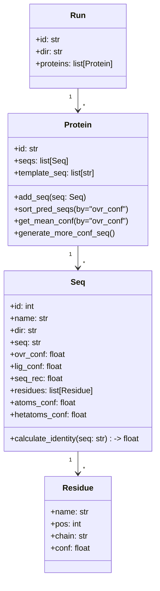

# 📄 LigandMPNN Run Processor

This script processes **LigandMPNN** run outputs, extracting structural and confidence information from generated **FASTA** and **PDB** files.

It includes:
- Parsing sequences and metadata from FASTA.
- Reading and analyzing PDB files to calculate confidence scores.
- Representing the run data in a class hierarchy for easy manipulation.

---

## 📂 Class Structure and Hierarchy



---

## 🔍 Main Functionalities

### 1. Helper Functions
- **`remove_gaps(lista)`** → Cleans empty or null elements in a list, removing newlines and spaces.
- **`mean(lista)`** → Calculates the average of the list values.

---

### 2. Classes

#### **Run**
Represents a complete LigandMPNN run.
- Attributes: `id`, `dir`, list of `proteins`.
- Instantiated in `parse_run()`.

#### **Protein**
Contains sequences associated with a given protein.
- `add_seq(seq)` → Adds a predicted sequence.
- `sort_pred_seqs(by)` → Sorts sequences by a metric (default: `ovr_conf`).
- `get_mean_conf(by)` → Calculates average confidence.
- `generate_more_conf_seq()` → Builds a "consensus" sequence with the most confident residue at each position.

#### **Seq**
Represents a predicted sequence.
- Holds: sequence, global confidence (`ovr_conf`), ligand confidence (`lig_conf`), residues, and PDB-derived confidence values.
- `calculate_identity(seq)` → Calculates identity with another sequence.

#### **Residue**
Represents a residue with name, position, chain, and average confidence.

---

### 3. PDB Processing
- **`open_design_pdb(pdb_file)`** → Reads lines from a PDB file.
- **`get_pred_conf(lines)`** → Extracts:
  - Average atom confidence (`atom_conf`).
  - Average heteroatom confidence (`hetatom_conf`).
  - List of residues with their average confidence.

---

### 4. FASTA Processing
- **`parse_fasta(fasta_file)`** → Returns `{header: seq}` dictionary.
- **`parse_seq(seq_key)`** → Extracts metadata (id, confidences) from the header.
- **`parse_run(run_dir)`** → Processes a full run:
  1. Creates a `Run` object.
  2. For each protein:
     - Reads FASTA sequences.
     - Assigns the template sequence.
     - Processes predicted sequences (`Seq`), reads PDB, and retrieves confidences.
  3. Returns the fully processed `Run`.

---

## 📈 Flow of `parse_run()`

```mermaid
flowchart TD
    A[Start parse_run(run_dir)] --> B[Extract run_id from directory name]
    B --> C[Create Run object]
    C --> D[List FASTA files in run_dir/seqs]
    D --> E[Loop over each FASTA file]
    E --> F[Create Protein object from file name]
    F --> G[Parse FASTA file into {header: sequence}]
    G --> H[Set first sequence as template_seq]
    H --> I[Loop over remaining sequences]
    I --> J[Parse sequence metadata from header]
    J --> K[Create Seq object with metadata and sequence]
    K --> L[Read PDB file for this sequence]
    L --> M[Extract confidences and residues from PDB]
    M --> N[Add Seq to Protein object]
    N --> O[Add Protein to Run object]
    O --> P[End loop over FASTA files]
    P --> Q[Return Run object]
```

---

## 📌 Example Usage

```python
# Process a run
run = parse_run("path/to/my_run")

# Access proteins and sequences
for protein in run.proteins:
    print(f"Protein: {protein.id}")
    top_seq = protein.sort_pred_seqs()[0]
    print(f"Top sequence confidence: {top_seq.ovr_conf:.2f}")
```
