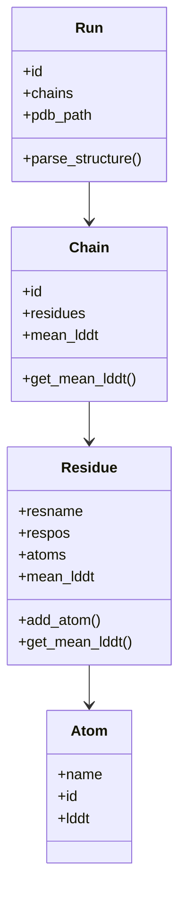

# RFAAtools – PDB Parser for RoseTTAFold-All-Atom

## 📌 Overview
**RFAAtools** is a Python utility for parsing and analyzing **RoseTTAFold-All-Atom** PDB output files.  
It reads `.pdb` structures generated by the model, extracts chain, residue, and atom data, normalizes residue names, ensures unique atom naming, and calculates **mean lDDT** scores per residue and per chain.

---

## ✨ Features
- **Custom PDB parsing** using `structools` (avoiding `Bio.PDB` limitations with duplicate HETATM names).
- **Residue name normalization** per chain (customizable mapping).
- **Unique atom naming** within residues by element.
- **Mean lDDT calculation** from B-factor fields for:
  - Individual residues  
  - Whole chains
- **Structured data representation** with `Run`, `Chain`, `Residue`, and `Atom` classes.

---

## 📂 Project Structure
- **`Run`** → Represents a parsed PDB file, storing multiple chains.  
- **`Chain`** → Contains ordered residues and chain-level statistics.  
- **`Residue`** → Stores atoms, residue name/position, and mean lDDT.  
- **`Atom`** → Holds atom name, serial ID, and lDDT score.  
- **`parse_run()`** → High-level function to parse a given `.pdb` path into a `Run` object.

---

## ⚙️ Installation
Ensure Python 3.8+ is installed and the following dependencies are available:

```bash
pip install numpy structools
```

*(Note: `structools` here refers to the custom/local module for PDB reading.)*

---

## 🚀 Usage

### Basic Example
```python
from rfaatools import parse_run

# Parse a PDB file
run = parse_run("path/to/structure.pdb")

# Access chains, residues, and lDDT
for chain in run.chains:
    print(f"Chain {chain.id} - Mean lDDT: {chain.mean_lddt:.3f}")
    for residue in chain.residues:
        print(f"  Residue {residue.resname}{residue.respos} - Mean lDDT: {residue.mean_lddt:.3f}")
```

### With Custom Residue Mapping
```python
custom_map = {
    "B": {"LG1": "HEM"},
    "C": {"LG1": "EST", "XYZ": "LIG"}
}

run = parse_run("path/to/structure.pdb", correct_resname=custom_map)
```

---

## 📊 Output Example
```
Chain A - Mean lDDT: 0.912
  Residue GLY1 - Mean lDDT: 0.900
  Residue VAL2 - Mean lDDT: 0.925
Chain B - Mean lDDT: 0.855
  Residue HEM1 - Mean lDDT: 0.860
```

---

## 🧠 How It Works
1. **File Reading:** Uses `structools.open_pdb()` to load the PDB file line-by-line.
2. **Line Parsing:** Extracts chain, residue, atom details via `structools.parse_pdb_line()`.
3. **Normalization:** Applies `correct_resname` mapping if provided.
4. **Atom Naming:** Ensures atoms are named uniquely within each residue.
5. **lDDT Calculation:** Averages `B-factor` values (as lDDT) per residue and chain.

---

## 🗂 Class Relationship Diagram


---

## 📜 License
MIT License – Feel free to use, modify, and distribute.
